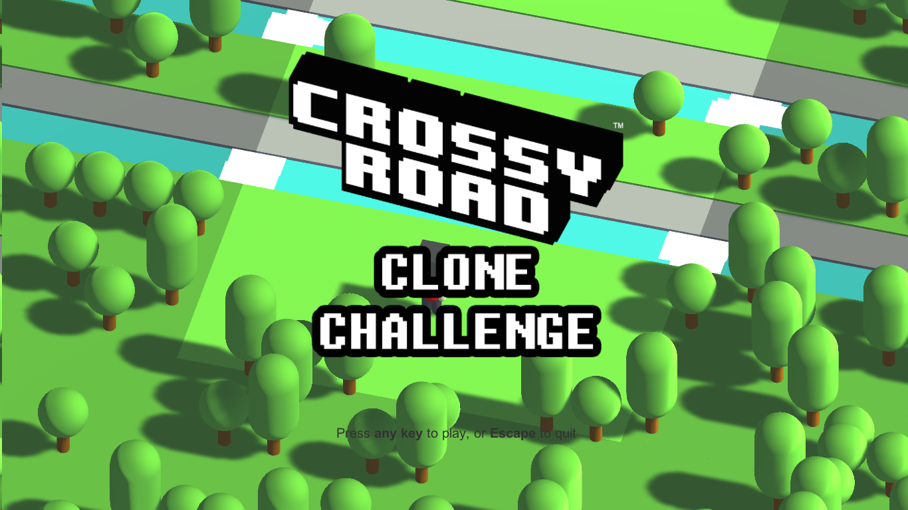
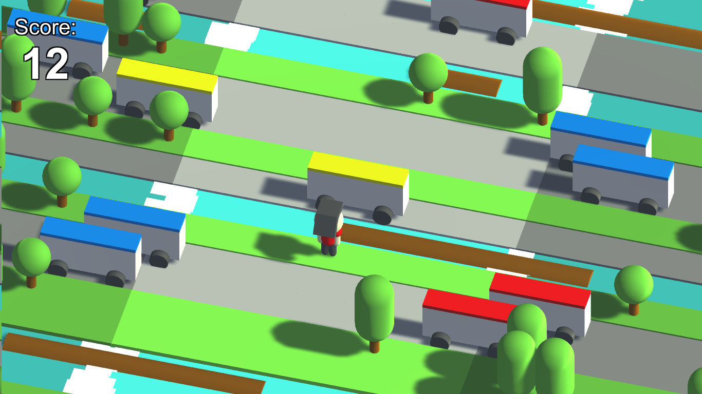
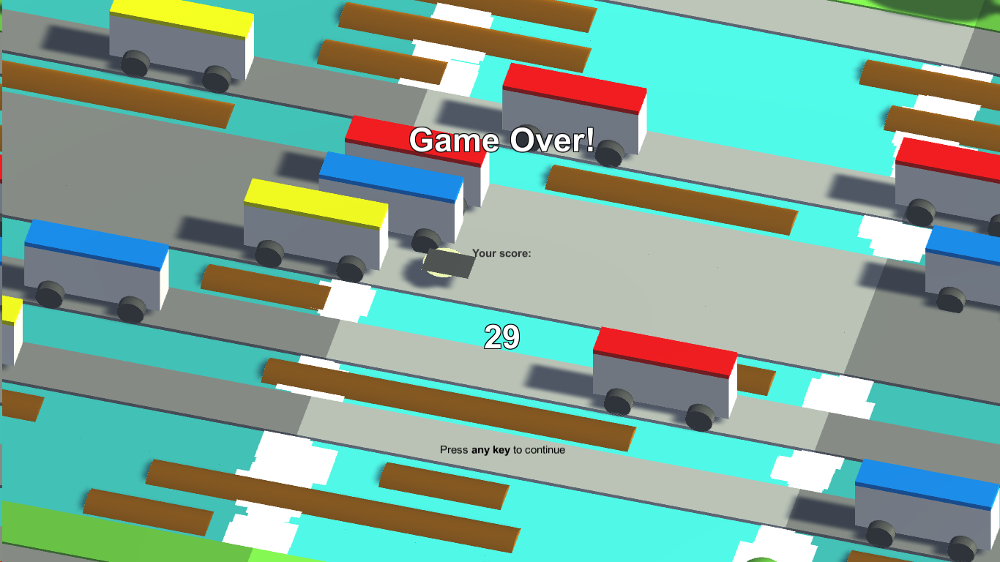

# Crossy Road Clone Challenge

Crossy Road Clone Challenge adalah sebuah game Unity sederhana yang merupakan tiruan dari [Crossy Road](http://www.crossyroad.com/).

Ketika pertama dibuat, kode sumber game ini dibangun tanpa menggunakan *assets* atau kamus apapun -- *simply pure Unity 5*. Versi sekarang yang menggunakan Unity 2017 menggunakan *post-processing asset* dari Unity supaya terlihat (sedikit) cantik.

## Tangkapan Layar

## Kontrol

- WASD: Bergerak kiri-kanan-atas-bawah.
- Escape: Keluar dari game (ketika tampilan awal muncul).

## Keterangan

- Karena dibuat hanya dalam waktu dua hari, saya tidak menuliskan komentar dengan rapi (terutama untuk bagian-bagian tertentu yang dibuat menjelang *deadline*). Setidaknya terdapat sedikit deskripsi untuk atribut-atribut dan fungsi-fungsi tertentu untuk mempermudah navigasi kode.
- Kembali, karena dibuat dalam waktu terbatas, banyak fungsi-fungsi yang relatif tidak optimal (menjadi bagian *bottleneck* pada game). Saya menyediakan TODO di beberapa bagian sebagai petunjuk jika ingin memanfaatkan kode yang ada.

## Lisensi

MIT License.
